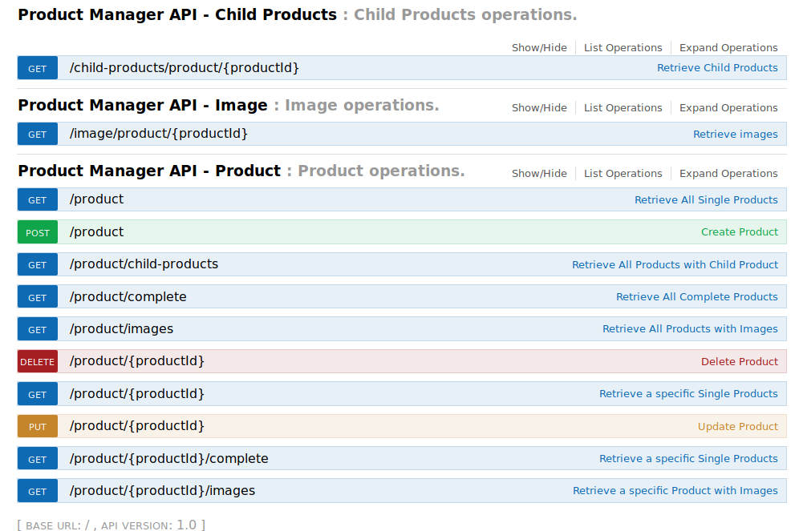
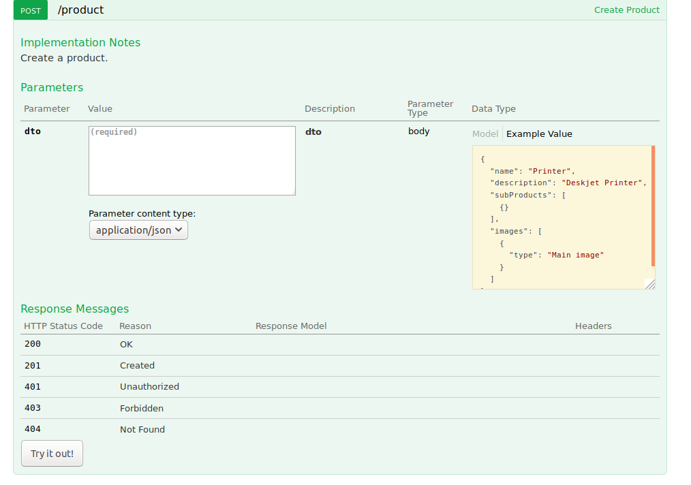
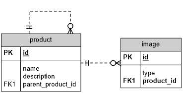

# Product Manager - SpringBoot REST PoC

## General

[](https://travis-ci.org/marcopollivier/product-manager)
[](https://codecov.io/gh/marcopollivier/product-manager)

The Application health can be checked on [BitBucket Pipeline](https://bitbucket.org/olliviermarco/avenuecode-product-manager/addon/pipelines/home#!/results)

## API

> - You can access the UI Application API on the address: [http://localhost:8080/swagger-ui.html#/Product](http://localhost:8080/swagger-ui.html#/Product)
> - This page documents the entire application API
> - You can also interact with Application API UI to request the endpoints
> - There is a call sample for each endpoint like the images below





## Run Tests and Application

- Build and compile application: ```mvn clean install```

- Run all tests: ```mvn test```

- Run application on Spring Boot: ```mvn spring-boot:run```

## Database

> - This application uses a memory database.  and the 
> - The chosen database is: **H2**
> - UI database can be access [here](http://localhost:8080/h2/login.do)
> - [Liquibase](http://www.liquibase.org/) is responsible to create the database structure and to menage it.

## Test Coverage
- **Unit tests**: 21%
- **Integrated Test**: Only on Image endpoints

## Technical Debit

> - All features was developed, but there is a technical debit on ProductService. 
> - It was necessary because SpringBoot is ignoring Lazy mode on relationship annotation 
> - So I solve it programmatically but not sounds good

## Scenario

We have a Product Entity with One to Many relationship with Image entity

Product also has a Many to One relationship with itself (Many Products to one Parent Product) 

##### 1º Build a Restful service using JAX-RS to perform CRUD operations on a Product resource using Image as a sub-resource of Product.

##### 2º Your API classes should perform these operations:

1. Create, update and delete products
2. Create, update and delete images
3. Get all products excluding relationships (child products, images) 
4. Get all products including specified relationships (child product and/or images) 
5. Same as 3 using specific product identity 
6. Same as 4 using specific product identity 
7. Get set of child products for specific product 
8. Get set of images for specific product


##### 3º Build JPA/Hibernate classes using annotations to persist these objects in the database 

###### Technical Specification:

1. Maven must be used to build, run tests and start the application.
2. The tests must be started with the mvn test command.
3. The application must start with a Maven command: mvn exec:java, mvn jetty:run, mvn spring-boot:run, etc.
4. The application must have a stateless API and use a database to store data.
5. An embedded in-memory database should be used: either H2, HSQL, SQLite or Derby.
6. The database and tables creation should be done by Maven or by the application.
7. You must provide BitBucket username. A free BitBucket account can be created at http://bitbucket.org. Once finished, you must give the user ac-recruitment read permission on your repository so that you can be evaluated. 
8. You must provide a README.txt (plain text) or a README.md (Markdown) file at the root of your repository, explaining:
    - How to compile and run the application with an example for each call.
    - How to run the suite of automated tests.
    - Mention anything that was asked but not delivered and why, and any additional comments.
    
## Data model


